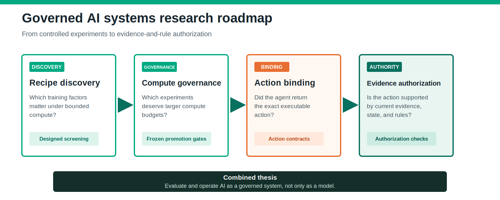

# Felipe Chavarro Polania

**I build governed AI systems: agents that can propose useful work while evidence, explicit rules, human approval, and deterministic controls retain final authority.**

[LinkedIn](https://www.linkedin.com/in/felipechavarro/) | [Website](https://www.felipechavarropolania.com/) | [ORCID](https://orcid.org/0009-0004-4963-3914) | [Publications](#publications)

> Agents propose. Humans approve. Deterministic controllers decide. AI explains.

## Start here

This repository is a compact research hub for controlled AI-agent evaluation and reproducible experimentation. The fastest way to see the core idea is the dependency-free state-bound authorization example:

```bash
python examples/state-bound-authorization/demo.py
```

Expected result:

```text
Proposal:              APPROVE_CHANGE
Structural checks:     PASS
Evidence/rule support: FAIL
Authorization:         WITHHELD
```

The proposal passes structural checks and names an allowed action, but the current policy state requires rejection. Parseable output is therefore not enough for execution authority.

[Run the example](examples/state-bound-authorization/README.md) | [Read the research program](research/README.md)

## Research program



| Research layer | Core question | Contribution | Status |
|---|---|---|---|
| Recipe Discovery | Which training factors matter under bounded compute? | Designed screening and replicated confirmation | [Published](https://arxiv.org/abs/2606.05186) |
| Compute Governance | Which candidates deserve larger compute budgets? | Auditable staged promotion with frozen gates | [Published](https://arxiv.org/abs/2606.11387) |
| Action Binding | Did the agent return an executable final action? | Final-action binding and strict format reliability | Submission manuscript |
| Evidence Authorization | Is that executable action supported by evidence and rules? | State-bound validity and deterministic authorization | Research in progress |

The sequence moves from experimental governance to action governance:

```text
discover useful factors -> promote experiments carefully -> bind the final action -> authorize only supported actions
```

## Publications

### Staged Factorial Screening for Budget-Constrained Micro-Pretraining

A bounded methods study using 613 experiments to identify high-penalty training directions, confirm promising anchors, and refine inside a reduced search space. The result supports a bridge-centered recommendation through 24 hours on two hosts; it does not claim general hyperparameter-optimization superiority.

[arXiv:2606.05186](https://arxiv.org/abs/2606.05186) | [DOI](https://doi.org/10.48550/arXiv.2606.05186)

### Small Experiments, Cheaper Decisions: A Case Study in Staged Promotion for Micro-Pretraining

A case study of short screens, replicated promotion gates, and bounded compute allocation. The study records 169.2 training GPU-hours and treats unrun continuations as accounting counterfactuals rather than proof that skipped candidates could not win.

[arXiv:2606.11387](https://arxiv.org/abs/2606.11387) | [DOI](https://doi.org/10.48550/arXiv.2606.11387)

## Current research

### Format-Bound Harnesses Repair Final-Action Failures in Controlled LLM Agent Evaluation

The Action Binding study separates executable-action validity from reasoning quality, regret, transport reliability, and deterministic controller behavior. A public arXiv link will be added when an identifier is available.

### A Valid Action Is Not Enough: Evaluating LLM Agents Against Evidence and Decision Rules

The Evidence Authorization study examines **state-bound validity**: whether a syntactically executable action is supported by the current task state, available evidence, and declared decision rule. The public example in this repository demonstrates the mechanism with synthetic, closed-world data; it is not a production safety claim.

## What I work on

- Governed agent workbenches with scoped tools, approval gates, and auditable artifacts.
- Evidence-bound evaluation that separates structure, support, and authorization.
- Deterministic controllers that translate declared contracts into reproducible decisions.
- AI product operating systems that connect product briefs, experiments, evidence, and release gates.
- Reproducible research with frozen hypotheses, explicit non-claims, and curated public artifacts.

## Public-work boundary

Everything in this repository is synthetic, public, or generalized. It contains no customer data, employer-confidential material, credentials, proprietary rule catalogs, private model logs, or unpublished review records.

## Repository map

- [`research/`](research/README.md): publication status, contribution boundaries, and the cross-paper program.
- [`examples/state-bound-authorization/`](examples/state-bound-authorization/README.md): runnable deterministic authorization example.
- [`docs/research-roadmap.svg`](docs/research-roadmap.svg): public visual summary of the research sequence.
- [`CITATION.cff`](CITATION.cff): citation metadata for this public research hub.

## Connect

[LinkedIn](https://www.linkedin.com/in/felipechavarro/) | [Website](https://www.felipechavarropolania.com/) | [ORCID](https://orcid.org/0009-0004-4963-3914)
